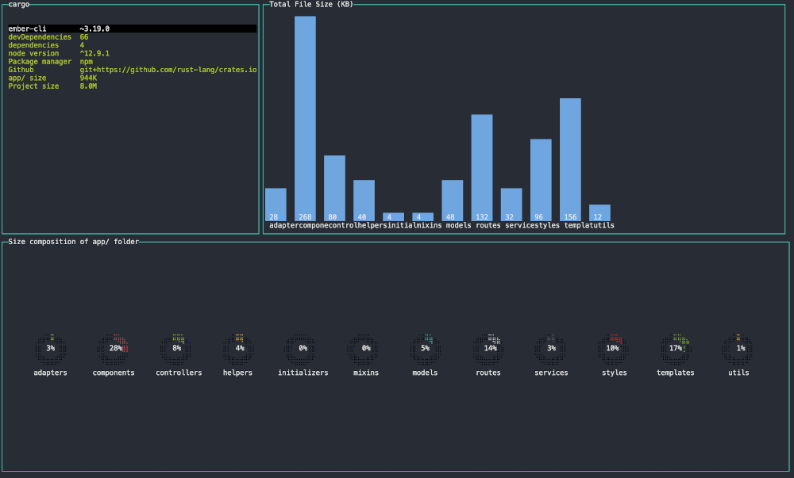

# ember-app-explorer

[](https://coveralls.io/github/rajasegar/eax?branch=master)
[](https://github.com/semantic-release/semantic-release)
[](https://npmjs.org/package/ember-app-explorer "View this project on npm")

A CLI tool to explore your Ember.js app folders to make better decisions for your
code maintainability and modularity.

## Features
- View your ember app details like ember-cli version, no of dependencies and dev dependencies, supported Node.js versions, the package manager used and so on.
- View File size composition of your `app/` folder
- Find the file size of your components, routes, etc in decreasing order
- You can export the file size data to a CSV format for deeper analysis
- Find the largest and heavy components and their dependencies with other entities
- Find where your components, services are used in the app
- Find the asset composition of your builds like percentage of JS,CSS and images
- View the compression statistics for your build assets like Gzip and Brotli

## Install
```
npm i -g ember-app-explorer

```

You can also use npx like:
```
npx ember-app-explorer
```

## Usage

Using current folder.
```
eax 
```

Specifying a path
```
eax ~/Users/user/code/my-ember-app
```

## Screenshots



## Help
List of Keyboard navigation shortcuts:
```
    ['Next Page', 'Right Arrow'],
    ['Prev Page', 'Left Arrow'],
    ['Up', 'Up Arrow / k'],
    ['Down', 'Down Arrow / j'],
    ['Select', 'Enter / l'],
    ['Quit', 'q / Esc / Ctrl-c'],
    ['Help', '?', '!'],
    ['Go to Home', '0'],
    ['Go to Build Stats', 'b'],
    ['Go to Components', 'c'],
    ['Go to Adapters', 'a'],
    ['Go to Controllers', 'o'],
    ['Go to File Sizes', 'f'],
    ['Go to Helpers', 'h'],
    ['Go to Mixins', 'x'],
    ['Go to Models', 'm'],
    ['Go to Routes', 'r'],
    ['Go to Services', 's'],
    ['Go to Utils', 'u'],
    ['Search', '/'],
    ['Export to CSV', 'e']
    ['To Move around in a page', 'Tab']
    ['Go to the beginning of any list', 'gg'],
    ['Go to the end of any list', 'G']
```

## FAQs

### How do I quit this thing?
You can press `q`, or `Esc` or `C-c` to quit the program at any time.

### How can I see the keyboard shortcuts for navigating?
Press `?` or `!` to see the keyboard navigation shortcuts page. 
There is an [issue](https://github.com/rajasegar/eax/issues/7) with `?` when you open the help page from a page containing lists, hence in those cases you can use the `!` for help.

### How can I quickly navigate to home page screen?
Press `0` to go to the home page.

### How do I navigate between different pages of the cli?
You can use the arrow keys to navigate between pages, `Left Arrow` to previous screen
and `Right Arrow` to next screen.

### How can I search for items in the list?
Press `/` to search in any list. A popup dialog will appear to enter the search term,
if the search functionality is enabled for that list where you have the focus.
The search term is fuzzy which means you can search for any part of the name and you
can also use regular expression search.

### Does it support vi/vim navigation keys in the lists?
Yes. You can use `j`,`k`,`gg`,`G`,`l` and `/`

### Can I export the data from the lists?
Yes. You can press 'e' to export your data from the lists in CSV format. 
It will prompt for a file name. But at present only the data from the `File Sizes` pages
can be exported. We are working on to add export feature to more lists.
